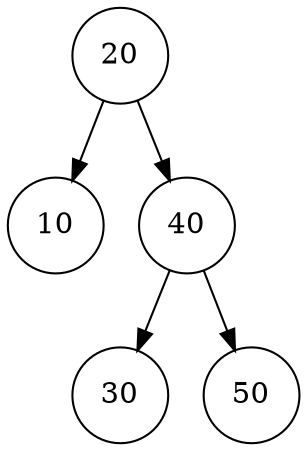

# CPPX Documentation

<p align="left">
  
</p>


CPPX is a cross-platform C++ template library providing extended data structures. It features a comprehensive automated test suite powered by Google Test.

## Requirements

- **C++17 compatible compiler**: GCC, Clang, or MSVC.
- **CMake (3.14+)**: Required for project configuration.
- **clang-format**: Automates code styling during the build process.
- **doxygen** **(Optional)**: Used for generating API documentation.
- **Internet connection**: Required for CMake to fetch Google Test.

## Install Dependencies

### Ubuntu/Debian

```bash
sudo apt update
sudo apt install build-essential cmake clang-format doxygen graphviz
```

### Fedora/RHEL

```bash
sudo dnf install cmake git clang-format doxygen graphviz
```

### Arch Linux

```bash
sudo pacman -S cmake git clang-format doxygen graphviz
```

### Windows

1. **Compiler**: Install [Visual Studio](https://visualstudio.microsoft.com/) (with "Desktop development with C++") or [MinGW-w64](https://www.mingw-w64.org/).

2. **CMake**: Download and install from [cmake.org](https://cmake.org/download/).

3. **Tools**: Install `clang-format` and `doxygen`(often included with LLVM or via [Chocolatey](https://chocolatey.org/)).

## Developer Workflow

#### Build & Test

1. **Linux / macOS**:

```bash
mkdir build && cd build
cmake ..
cmake --build .
```

2. **Windows(PowerShell)**:

```bash
mkdir build; cd build
cmake ..
cmake --build .
```

> **Note:** If the build finishes without error, it means all tests passed. If a test fails, the build command will exit with an error and display the failure details.

## Integration

To use this library in any of your existing projects:

1. **Copy Folders**: Move the `src` and `include` folders from this repository into your project directory.

2. **Include Header**: In your C++ file, include the main header:

```cpp
#include "include/cppx.h"
```

3. **Compile**: Ensure your compiler knows where to look for the template files. You may need to add the src and include paths to your compilation command, otherwise run as usual.

## Coding Style

- **Automatic Formatting**: The build system applies `clang-format` rules to all `.cpp`, `.tpp`, and `.h` files automatically.

- **Namespaces**: All components reside within the stl_ext namespace.

## Usage

- **API Reference:** **[Online Documentation](https://ifkabir.github.io/CPPX/)** (Recommended)

- **Version Info:** Check the [Releases page](https://github.com/IFKabir/CPPX/releases) for version-specific notes and changes.

## Tree Visualization

CPPX includes built-in visualization tools on every tree type to help with debugging and understanding tree structures.

### Console Printing (`print_tree`)

Prints a **sideways/rotated** tree to `std::cout` using box-drawing characters. The right subtree appears on top, and the left subtree on the bottom.

```cpp
#include "cppx.h"
using namespace stl_ext;

int main() {
    AVLTree<int> tree;
    for (int v : {10, 20, 30, 40, 50})
        tree.insert(v);

    tree.print_tree();
}
```

**Output:**
```
        ┌── 50
    ┌── 40
10
    └── 30
└── 20
```

### Graphviz Export (`dump_to_dot`)

Exports the tree to a `.dot` file that can be rendered with [Graphviz](https://graphviz.org/).

```cpp
tree.dump_to_dot("tree.dot");
```

Then render with:
```bash
dot -Tpng tree.dot -o tree.png
```

**Generated `tree.dot`:**


## Performance

CPPX includes an automated benchmark suite that compares `stl_ext::AVLTree`, `stl_ext::BST`, and `std::set` (Red-Black Tree) across three key operations.

### Benchmark Results

| Structure | N | Insert (ms) | Lookup (ms) | Delete (ms) |
|---|---:|---:|---:|---:|
| `std::set` | 10K | 0.63 | 0.29 | 0.09 |
| `stl_ext::AVLTree` | 10K | 1.53 | 0.29 | 0.16 |
| `stl_ext::BST` | 10K | 1.86 | 0.33 | 0.12 |
| `std::set` | 100K | 11.68 | 7.10 | 1.61 |
| `stl_ext::AVLTree` | 100K | 33.55 | 7.61 | 3.68 |
| `stl_ext::BST` | 100K | 33.18 | 7.49 | 2.90 |
| `std::set` | 1M | 477.55 | 260.82 | 61.08 |
| `stl_ext::AVLTree` | 1M | 860.29 | 241.79 | 92.53 |

> **Note:** `stl_ext::BST` is skipped at N=1M because an unbalanced BST with random data can produce very deep recursion.

### Results Chart


### Analysis

- **`std::set` (Red-Black Tree)** is the fastest overall. Its implementation benefits from decades of standard-library optimisation (cache-friendly allocators, intrusive nodes, etc.), giving it a ~2–3× advantage on insertion and deletion over the CPPX structures.

- **`stl_ext::AVLTree` vs `std::set` on lookups**: At 1M elements the AVL tree is **~7% faster** on lookups (241.8 ms vs 260.8 ms). This demonstrates the core AVL trade-off: *stricter balancing produces a shorter tree, which pays off during search-heavy workloads*.

- **`stl_ext::BST` vs `stl_ext::AVLTree`**: At 100K, the BST is slightly faster on insertion (no rotations) and deletion, but lookup performance is nearly identical because the random insertion order keeps the BST reasonably balanced. Worst-case (sorted input) would cause the BST to degrade to O(n).

- **Insert cost**: AVL rotations add overhead during insertion (~1.8× slower than `std::set`), which is the expected cost of maintaining strict balance.

### Running the Benchmark

Build and run with a single command — no scripts or external tools required:

```bash
cmake --build build --target run_benchmark
```

This will:
1. Compile the benchmark binary with `-O2` optimisations.
2. Run it, printing a results table to the console.
3. Export `docs/benchmark_results.csv`.
4. Generate `docs/benchmark_chart.svg` (pure C++, no Python needed).
