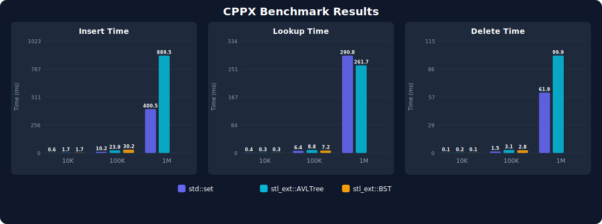

# CPPX

<p align="left">
  
</p>

A cross-platform C++23 template library providing extended data structures with arena-based memory pooling, automated testing via Google Test, and benchmark tooling.

**[API Reference](https://ifkabir.github.io/CPPX/)** · **[Releases](https://github.com/IFKabir/CPPX/releases)**

---

## Requirements

- C++23 compiler (GCC / Clang / MSVC)
- CMake 3.14+
- clang-format
- Internet (CMake fetches Google Test)
- doxygen + graphviz *(optional, for API docs)*

---

## For Users

### Installation

Copy the `src/` and `include/` folders into your project, then:

```cpp
#include "include/cppx.h"
```

Add `src/` and `include/` to your compiler's include paths.

### Quick Start

```cpp
#include "cppx.h"
using namespace stl_ext;

int main() {
    AVLTree<int> tree;
    for (int v : {10, 20, 30, 40, 50})
        tree.insert(v);

    tree.contains(30);  // true
    tree.get_min();     // 10
    tree.print_tree();  // visual debug
}
```

### Tree Visualization

**Console** — `print_tree()` renders a sideways tree:
```
        ┌── 50
    ┌── 40
10
    └── 30
└── 20
```

**Graphviz** — `dump_to_dot("tree.dot")` exports a `.dot` file:
```bash
dot -Tpng tree.dot -o tree.png
```

---

## For Developers

### Build & Test

```bash
mkdir build && cd build
cmake ..
cmake --build .
```

> Build succeeds = all tests pass. Failures stop the build with details.

### Run Benchmarks

```bash
cmake --build build --target run_benchmark
```

Compiles with `-O3 -march=native`, runs the suite with warmup + median-of-3 timing, and outputs `docs/benchmark_results.csv` + `docs/benchmark_chart.svg`.

### Code Style

- `clang-format` runs automatically on every build.
- All code lives in `namespace stl_ext`.

---

## Architecture

All trees use an **arena allocator** (`NodePool`) that allocates nodes in contiguous 4096-node blocks, dramatically improving cache locality and eliminating per-node heap allocation overhead. Nodes use **raw pointers** (no `std::unique_ptr`), making rotations simple 3-pointer swaps.

Key design choices:
- **`int8_t` height field** — AVL tree heights never exceed 45 for practical inputs
- **`uint8_t` Color enum** — saves padding bytes in the node layout
- **Iterative AVL insert/remove** — avoids deep recursive stack frames
- **Parent pointers on all nodes** — enables efficient iterative RBTree rotations

---

## Performance

Benchmarks compare `stl_ext::AVLTree`, `stl_ext::BST`, `stl_ext::RBTree`, `std::map`, `std::set`, and `std::unordered_set`.

| Structure | N | Insert (ms) | Lookup (ms) | Delete (ms) |
|---|---:|---:|---:|---:|
| `std::map` | 10K | 0.85 | 0.33 | 0.09 |
| `std::set` | 10K | 0.79 | 0.32 | 0.09 |
| `std::unordered_set` | 10K | 0.20 | 0.04 | 0.02 |
| `stl_ext::AVLTree` | 10K | 1.58 | 0.26 | 0.18 |
| `stl_ext::BST` | 10K | 0.64 | 0.29 | 0.07 |
| `stl_ext::RBTree` | 10K | 0.71 | 0.26 | 0.08 |
| `std::map` | 100K | 14.96 | 6.63 | 1.70 |
| `std::set` | 100K | 14.65 | 6.56 | 1.62 |
| `std::unordered_set` | 100K | 3.09 | 0.54 | 0.37 |
| `stl_ext::AVLTree` | 100K | 21.06 | 5.22 | 2.48 |
| `stl_ext::BST` | 100K | 10.94 | 6.19 | 1.36 |
| `stl_ext::RBTree` | 100K | 10.91 | 5.25 | 1.34 |
| `std::map` | 1M | 495.52 | 240.18 | 56.05 |
| `std::set` | 1M | 482.13 | 244.48 | 55.52 |
| `std::unordered_set` | 1M | 137.60 | 12.50 | 16.35 |
| `stl_ext::AVLTree` | 1M | 459.19 | 163.96 | 72.13 |
| `stl_ext::RBTree` | 1M | 284.37 | 162.31 | 39.44 |

> `stl_ext::BST` skipped at 1M — unbalanced tree causes deep recursion.



### Key Takeaways

- **`stl_ext::RBTree` now outperforms `std::set`** — at 1M elements, insert is **1.7x faster** (284ms vs 482ms) and delete is **1.4x faster** (39ms vs 56ms), thanks to arena allocation and raw-pointer rotations.
- **`stl_ext::AVLTree` beats `std::set` on lookups** — 164ms vs 244ms at 1M, since stricter balancing yields shallower trees.
- **`stl_ext::BST` is fastest at small N** — the simplest tree with no rebalancing overhead dominates at 10K–100K on random data.
- **`std::unordered_set`** remains unbeatable for pure lookup workloads (O(1) amortized).
